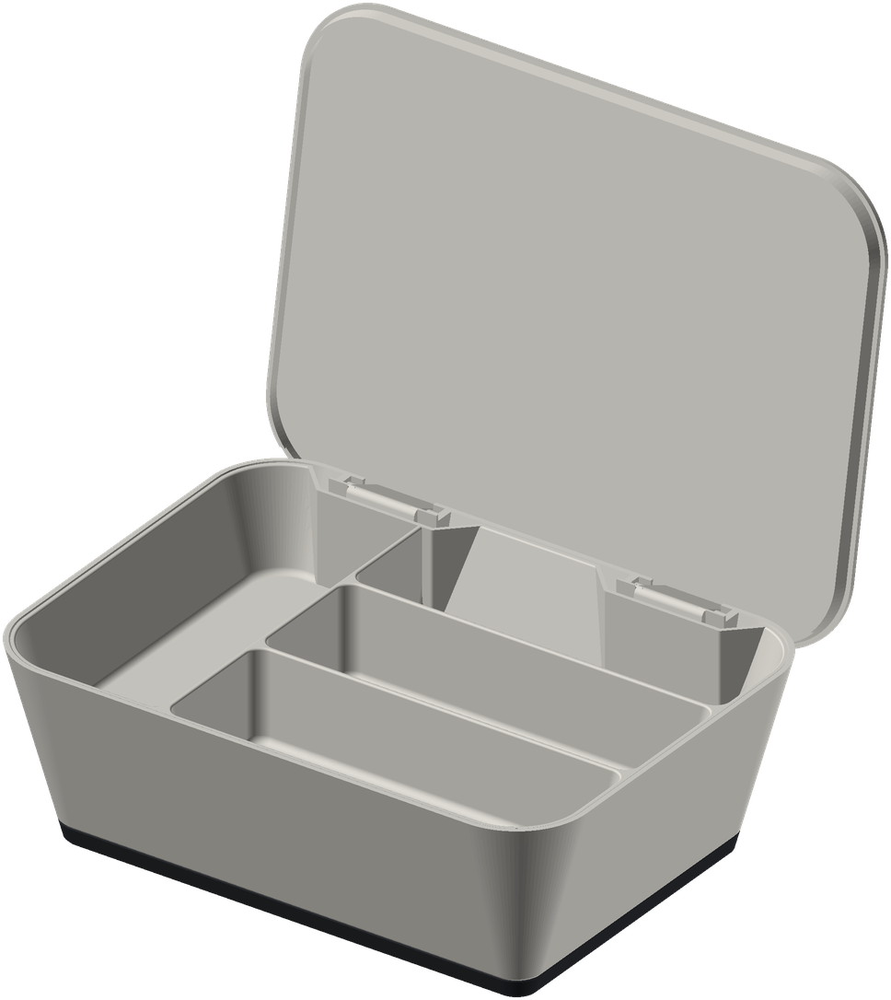
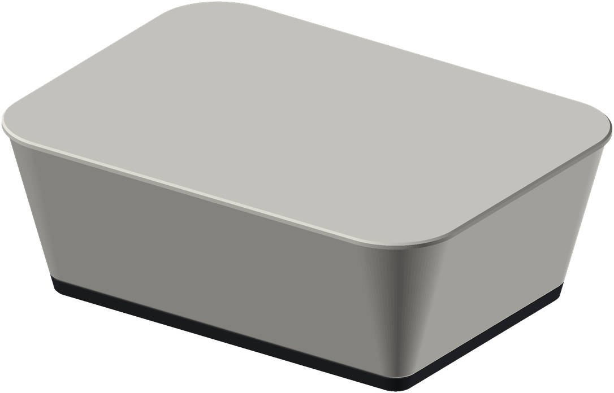
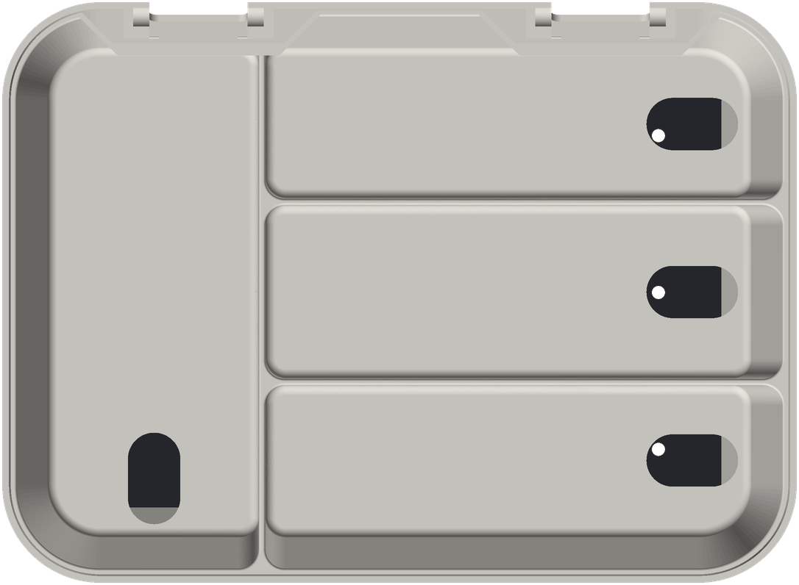
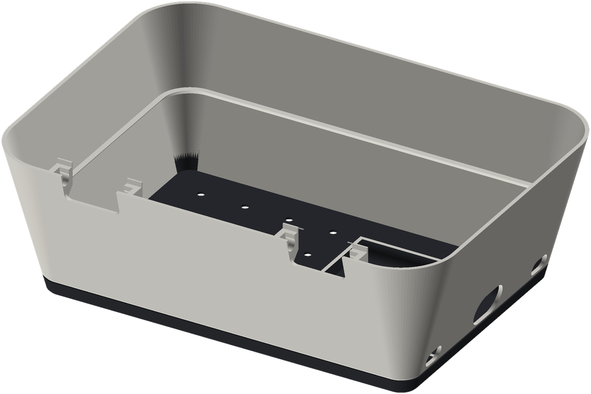

# Bike charging dock

A 3D-printed desk dock for cycling electronics. A multi-port USB charger is
hidden inside, cables run up through the tray to each device, and a hinged lid
closes over them. The shell tapers at 15 degrees on every side and prints in
two colours, a dark foot band and a light body.

| Closed | Tray from above | Base from behind |
|---|---|---|
|  |  |  |

- About 243 x 178 x 88 mm, and every part fits a 250 mm bed.
- Bays are sized for a Wahoo Elemnt Roam 3, a Bontrager Ion headlight and a Wahoo Trackr radar, plus one open bay.
- The charger is an Anker A2154 six-port desktop charger. It stands in a fence in the base, and its mains cord comes in through a port in the end wall.
- Two escape ports beside the charger let a cable out to charge something outside the dock.
- The lid uses a concealed leaf hinge with no hardware. Its printed pins snap into the base, and the lid opens to about 100 degrees and stops there.
- All of it is fully parametric [build123d](https://github.com/gumyr/build123d) code. The tests check the fit, the swing of the lid and printability (no overhang past 45 degrees).

The shape is inspired by the Trek CHRGtime charging station. This project is
not affiliated with or endorsed by Trek.

## Print it

Ready-made STL, STEP and an Orca Slicer project are on the
[releases page](../../releases). The design was printed and tested on a
Snapmaker U1 in PETG; PLA works as well.

| Part | Orientation | Supports |
|---|---|---|
| hinge_coupon_base, hinge_coupon_lid | as exported | none (pins: only if they droop) |
| coupon_plate, coupon_peg | as exported | none |
| tray | plate down | none |
| base | open top up | **off**, or auto supports will fill the ports |
| lid | top face down | under the leaf pins only if needed |

Settings: 0.4 mm nozzle, 0.2 mm layers, 3 walls, 15 % infill.

- **Print the coupons first.** The hinge coupon is one hinge station cut from the real base and lid. It shows whether the pins snap in and turn freely on your printer before you commit to the big parts. The clearance coupon checks the general fit.
- **Two-tone base:** start in the dark filament and change to the light one at the first layer above 8.0 mm (8.2 mm at 0.2 mm layers). The groove round the foot hides the seam, and the charger fence prints fully dark. With a single-change toolchanger, turn the prime tower off.
- **Fit the lid:** set it on the rim with the leaves over their notches and press the back edge down until the pins snap in. Lift the back edge straight up to take it off.

There is more detail in [docs/printing.md](docs/printing.md).

## Adapt it

Everything is driven by a few files:

- `src/dock/measurements.py` holds your devices, charger and plugs. Measure them with calipers as described in [docs/measuring.md](docs/measuring.md).
- `src/dock/layout.py` sets where the bays go.
- `src/dock/params.py` holds the design rules: wall thickness, clearances, draft angle, colour band.
- `src/dock/hinge.py` sets the hinge fit (`SNAP`, `BORE_CLR`). Tune it with the hinge coupon.

Then rebuild:

    uv venv --python 3.12 && uv pip install -e ".[dev]"
    uv run pytest                              # fit, swing and printability checks
    uv run python scripts/export_all.py        # out/*.stl and *.step
    uv run python scripts/orca_project.py      # out/orca/dock_plates.3mf, one part per plate
    uv run python scripts/render.py            # docs/images/*.png
    uv run python -m ocp_vscode                # optional viewer at http://localhost:3939

build123d needs Python 3.12. The design history is in
[docs/superpowers/](docs/superpowers/): the specs and plans for each version.

## Parts

- **tray**: a flat plate with four device bays and fixed, filleted dividers. Each bay has an oval cable cutout at its outer end.
- **base**: the tapered, two-tone lower shell. It hides the charger and the cable slack, and carries the tray on a ledge.
- **lid**: a tapered cap whose hinge leaves hang into notches in the base's back wall.
- **coupons**: a clearance plate and peg, and the hinge coupon.

## License

- Models and images: [CC BY 4.0](LICENSE-models.md).
- Code: [MIT](LICENSE).
